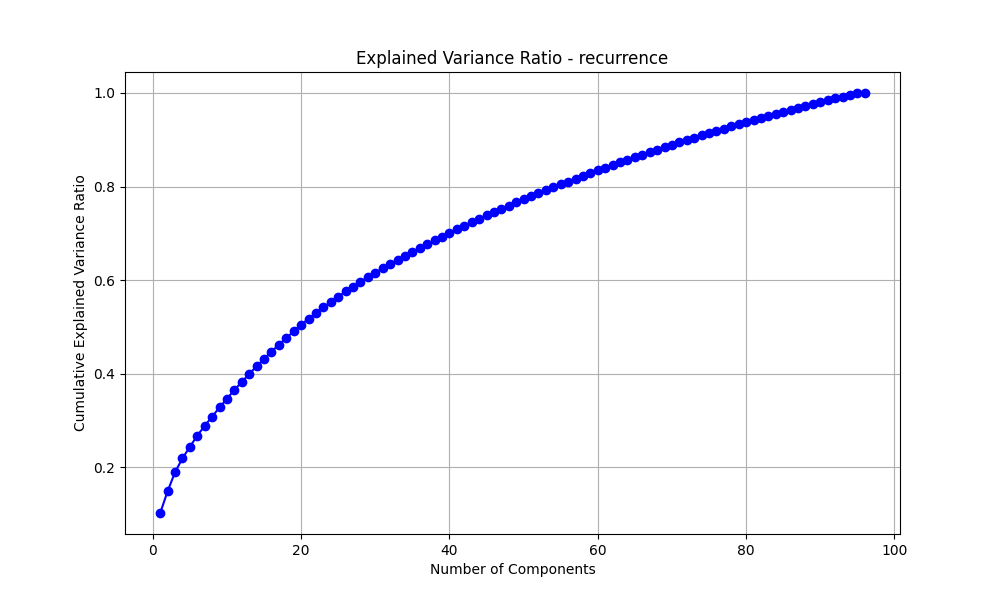
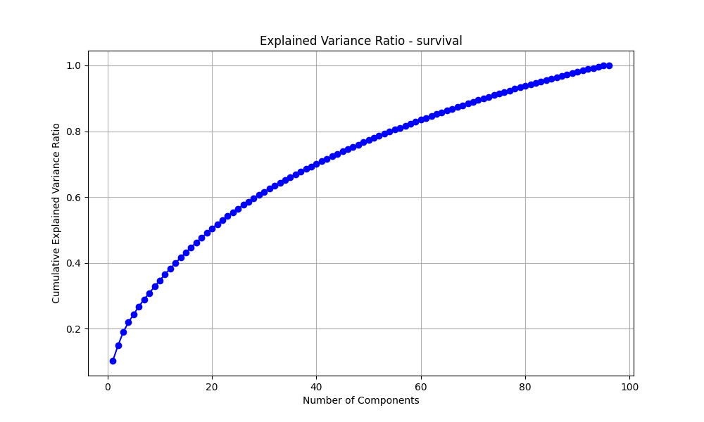
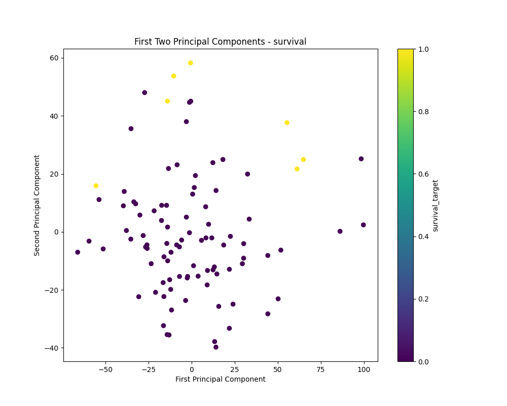

# ColorectalCancerOmics
5/24/2025 I am downloading the COAD tsv files for miRNA, clinical, phosphoproteomics, proteomics, transcriptomics and somatic mutation using the CPTAC python API
Used several python scripts to iteratively join, filter and merge the data sets. 

Cleaned the data  
Initial dataset: 96 rows × 143,423 columns  
Found and removed 35,569 columns that contained only NaN values  
Final cleaned dataset: 96 rows × 107,854 columns  

Per extent literature I used - Student’s t test, Mann-Whitney U test, ANOVA (Analysis of Variance), chi-square test, and Fisher’s exact test to select key features further filtering the dataset... this takes way too long to check each feature like this. I am going to prefilter the data using varaince thresholding and correaltion analysis. Then I will run the aforementioned tests to get the key features.

| Data Type           | Original Shape    | Final Shape     | Survival Features     | Recurrence Features     |
|---------------------|-------------------|------------------|------------------------|--------------------------|
| Clinical            | (96, 125)         | (96, 12)         | Retained              | Retained                 |
| miRNA               | (96, 2583)        | (96, 327)        | 168                   | 165                      |
| Proteomics          | (96, 9153)        | (96, 917)        | 384                   | 570                      |
| Phosphoproteomics   | (96, 70,973)      | (96, 1995)       | 934                   | 1099                     |
| Transcriptomics     | (96, 60,592)      | (96, 6275)       | 2213                  | 4307                     |

I then joined the the data types to create two dataframes with different goals one based on survival and the other on recurrence:

### DataFrames Summary

| Dataset              | Shape                 | Target Variable     | Events Present           | Notes                                                       |
|----------------------|------------------------|----------------------|---------------------------|-------------------------------------------------------------|
| **Survival**         | 96 patients × 9,518 features | `survival_target`     | 7 survival events         | Includes selected clinical features and all omics data      |
| **Recurrence**       | 96 patients × 9,519 features | `recurrence_target`   | Recurrence events present  | Includes all survival features plus `new_tumor_after_initial_treatment` |

I used prinipal component analysis to obtain the charts below but it appears that we need 73 components to explain 90% of the variance. Prior research has used 2 principal components but this seems like a lot of data loss.

Once I get a clean dataset that will dimensionally run a ML model I plan to start with a GNN. A recent study by Li et al. used an ensemble method with LR,SVM and NB. I will likely recreate that model and then compare the graph model to it so see if I can outperorm the model.

**************************************************************************************************************************************************************************
This is just Gen-omics research currently. 
This analysis is written in R using the data from TCGA, analyzing based on the available cancer markers.

5/22/2025 The underlying data is from 481 files with a size 2.03 gb. It took a little while to download directly into RStudio.

The Cancer Genome Atlas (TCGA), specifically the colorectal cancer cohort, which includes colon adenocarcinoma (COAD) and rectal adenocarcinoma (READ) cases. I ended up only using the READ cases. 166 cases with over 60k variables for gene expression associated with READ, it was the smaller dataset. 

5/23/2025 I created a heat map that shows each column as a tumor and each row as a gene expression for normal and READ patients. 

I did some hierarchal clustering on the normal and READ cases. And found some overlap in the 2 clusters.

### Sample Clustering Results

| Cluster | Normal Samples | Tumor Samples |
|---------|----------------|----------------|
| 1       | 0              | 158            |
| 2       | 41             | 8              |

I am very interested in the 8 cases that are overlapping...Tumors with lower malignancy or stromal contamination, Misclassified samples (rare in TCGA, but possible), Candidates for deeper clinical or molecular subtype review

Further analysis of the 8 cases in cluster 2 reveal 50/50 of early and late stage cancers:
### Tumor Stage Distribution – "Normal-like" Tumors

| Tumor Stage | Count |
|-------------|-------|
| Stage I     | 1     |
| Stage II    | 1     |
| Stage IIA   | 2     |
| Stage IIIB  | 2     |
| Stage IIIC  | 1     |

This suggests that clustering with normal samples may partly reflect stage, but other factors are likely influencing expression, such as:Tumor purity (high stromal/immune content may skew expression), Tumor location, MSI status or other molecular subtypes

### MSI Status & Anatomic Location – "Normal-like" Tumors

| Sample ID         | MSI Status | Anatomic Location |
|-------------------|------------|--------------------|
| TCGA-EI-6506      | NA         | NA                 |
| TCGA-AG-3602      | MSS        | Rectum             |
| TCGA-CI-6624      | NA         | NA                 |
| TCGA-AG-3909      | MSS        | Rectum             |
| TCGA-AF-6136      | NA         | NA                 |
| TCGA-AH-6547      | NA         | NA                 |
| TCGA-AG-4022      | NA         | NA                 |
| TCGA-AG-A01J      | MSS        | Rectum             |

MSI status: 3 of 8 are explicitly MSS (microsatellite stable); the rest are missing MSI info. Tumor location: 3 of 8 are from the rectum, others are unspecified. As I am only looking at Rectal cancer patients this makes sense but that means 5 of these patients have gene expressions for rectal cancer but have yet to present.

*****************************************************************************************************************************************************************************************

Went back to (READ) full sample and did a KNN analysis. Started with a silhouette analysis to find optimal clusters. 2 is the highest thus I ran a PCA differentiated by the 2 clusters. It found similar clusters to that of he hierarchal clustering.

*****************************************************************************************************************************************************************************************

**Predictive Modeling with Supervised Machine Learning**

